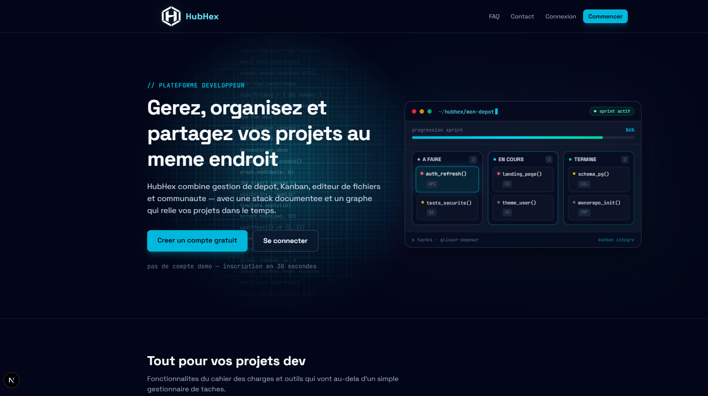
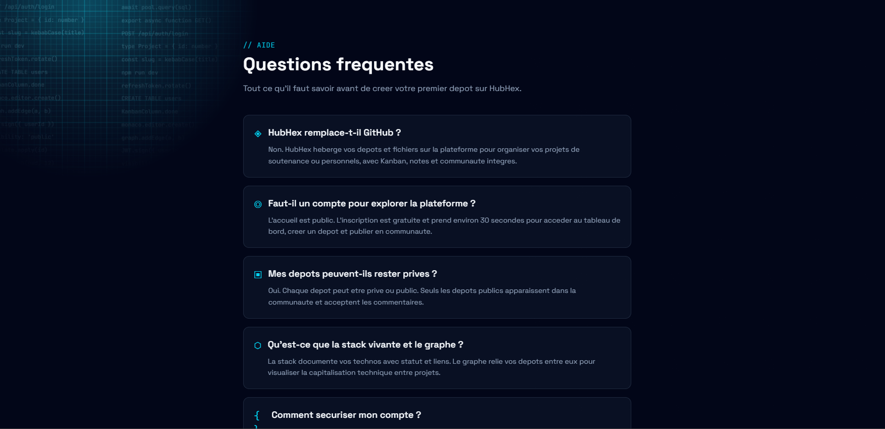
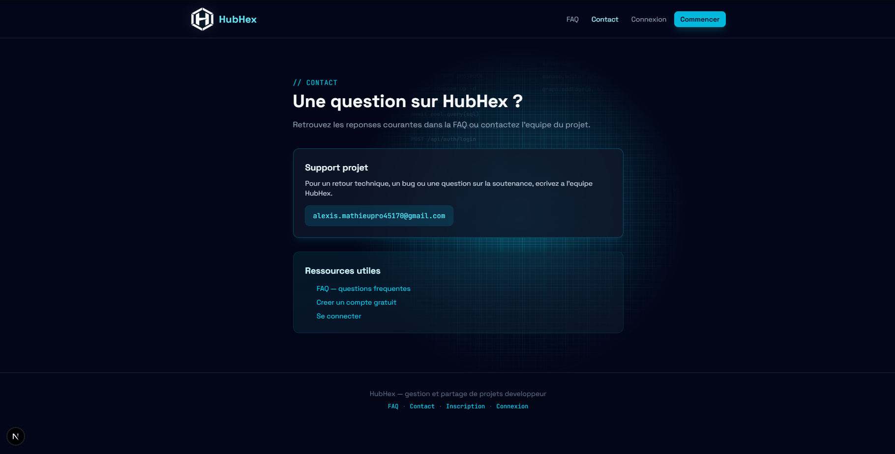
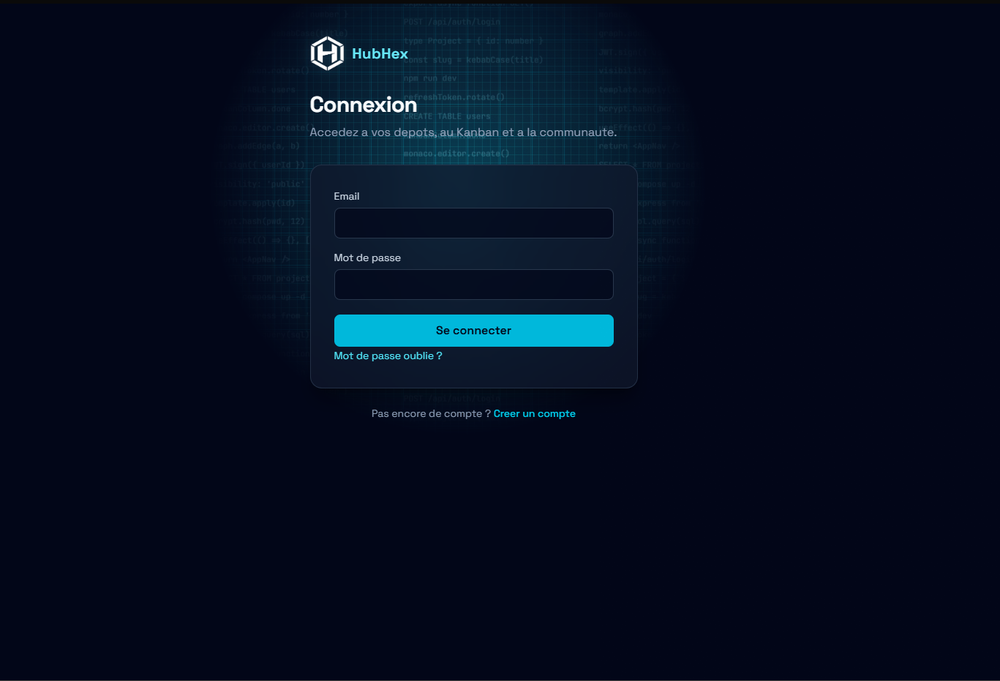
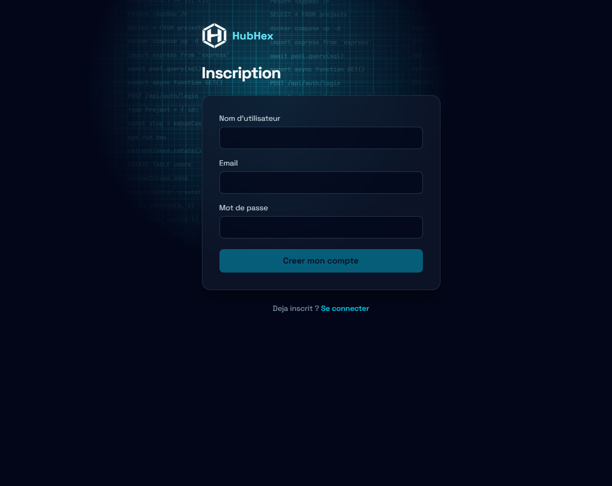
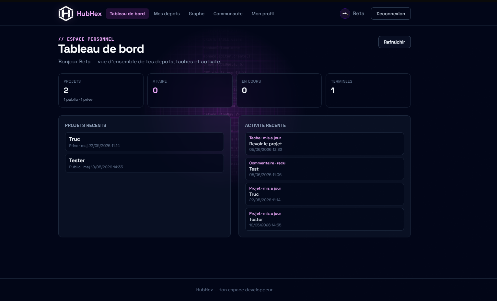
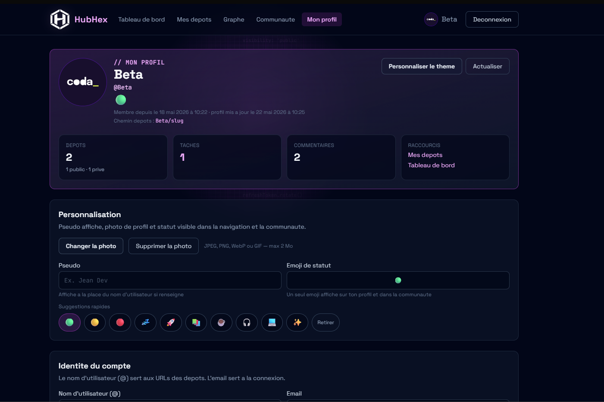

# HubHex — Guide utilisateur

## Sommaire

1. [Page d'accueil](#page-daccueil)
2. [Inscription](#inscription)
3. [Connexion](#connexion)
4. [Mes depots](#mes-depots)
5. [Graphe HubHex](#graphe-hubhex)
6. [Communaute](#communaute)
7. [Profil](#profil)
8. [Premier compte](#premier-compte)
9. [Captures d'ecran](#captures-decran)

## Page d'accueil

- URL : **http://localhost:3000/** (route `/`)
- Presentation des fonctionnalites HubHex, liens vers inscription et connexion
- Apercu Kanban anime sur la page (vitrine, sans compte requis)
- Si vous etes deja connecte, redirection automatique vers le **tableau de bord**

## Inscription

- URL : **http://localhost:3000/inscription** (route `/inscription`)
- Formulaire dedie : pseudo, email, mot de passe fort
- Apres inscription reussie, connexion puis acces au tableau de bord

## Connexion

- URL : **http://localhost:3000/connexion** (route `/connexion`)
- Page separee de l'inscription (plus d'onglets communs sur une seule page)
- Lien **S'inscrire** vers `/inscription` si vous n'avez pas encore de compte
- Mot de passe oublie : un email est envoye si SMTP est configure ; sinon le token peut apparaitre en mode developpement
- La session se renouvelle automatiquement (refresh token) tant que vous restez connecte

## Mes depots

- Creer un depot avec titre, identifiant (`username/slug`), description et technologies
- **Templates** : en bas du formulaire de creation, choisir un modele (ex. « Application web full-stack ») pour pre-remplir taches et description
- Onglets par depot :
  - **Fichiers** : arborescence, import, double-clic ou bouton **Editer** pour modifier un fichier texte
  - **Kanban** : glisser-deposer les taches entre colonnes
  - **Maitrise** : pour chaque badge techno du depot, indiquer le niveau (a venir / en cours / maitrisee) + lien ou note optionnels
  - **Journal** : decisions techniques datees
  - **Notes** : notes techniques separees de la description
  - **Parametres** : visibilite public/prive

### Onglet Maitrise (technologies du depot)

Les **badges** en haut du depot (React, PostgreSQL…) sont la liste officielle des technos. L'onglet **Maitrise** reprend automatiquement cette liste : vous n'ajoutez plus une deuxieme fois la meme techno.

Pour chaque badge :

| Champ | Description |
|-------|-------------|
| **Niveau** | A venir · En cours · Maitrisee |
| **Lien doc** | Optionnel (site officiel, tutoriel…) |
| **Note / extrait** | Optionnel (commande, requete SQL, rappel) |

Pour ajouter ou retirer une technologie : **Modifier** le depot (parametres) — la fiche Maitrise se met a jour automatiquement.

## Graphe HubHex

Menu **Graphe** : reliez vos depots (meme techno, inspire de, suite de…) pour visualiser la capitalisation entre projets.

## Communaute

- Parcourir les depots **publics**
- Rechercher par mot-cle, filtrer par technologie, trier par recent ou populaire
- Commenter (suppression par auteur ou proprietaire du projet)

## Profil

- Pseudo, statut, photo (max 2 Mo)
- Modifier email / mot de passe / supprimer le compte
- Profils publics : `/utilisateurs/nom-utilisateur`

## Premier compte

Aucun compte n'est cree automatiquement. Depuis l'**accueil** (`/`), cliquez sur **Commencer** ou **S'inscrire**, ou ouvrez directement `/inscription`. Mot de passe fort requis (majuscule, minuscule, chiffre, symbole).

Demarrage local : voir [CHECKLIST_DEMARRAGE_LOCAL.md](CHECKLIST_DEMARRAGE_LOCAL.md).

## Captures d'ecran

